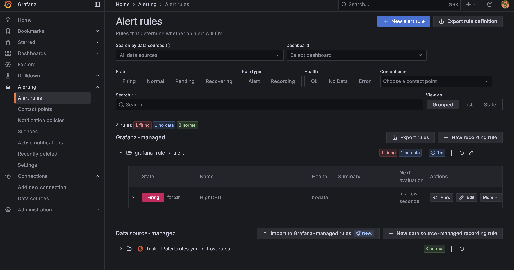
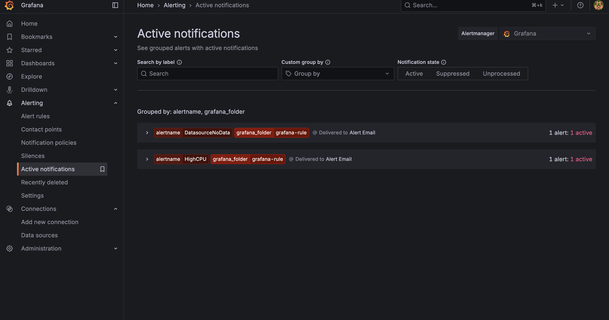
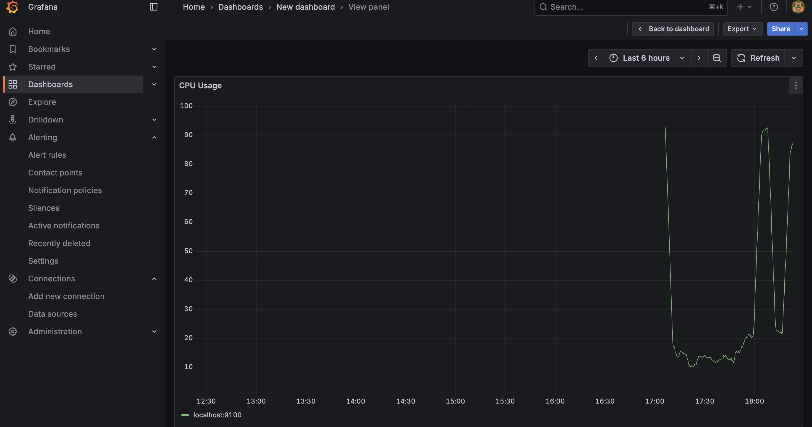

# Monitoring and Alerting System for CampusWatch: Task 1

## What Was Built

A monitoring and alerting system for the CampusWatch platform that provides real-time notifications for critical infrastructure issues. The main focus was creating a system that reduces noise and only sends meaningful, actionable alerts.

## Technologies Used

- **Prometheus** - For collecting and storing metrics
- **Node Exporter** - To get system metrics like CPU and memory
- **Grafana** - For visualizing data and managing alerts
- **Homebrew** - To install everything on macOS


## Research and Best Practices

Before implementation, I conducted research on industry alerting best practices to ensure the system would be both effective and maintainable. Although I could not implement all of the best practices, I did implement the following:

- Noise Reduction: Approaches to prevent alert fatigue through sustained condition thresholds
- Severity Classification: Standard severity levels (Critical, Warning, Info) for different types of incidents
- Notification Channels: Email notifications for various alert types
- Metric Selection: CPU and memory metrics provide the most actionable insights
- Threshold Tuning: Industry standards for resource usage thresholds (80% CPU/memory as warning levels)

These practices directly influenced the for: clauses in alert rules and the choice of 80% thresholds for resource monitoring.


## Implementation Steps

### 1. Prometheus Configuration

Configured Prometheus to collect system metrics by editing the `prometheus.yml` file:

```yaml
global:
  scrape_interval: 15s

rule_files:
  - alert.rules.yml

scrape_configs:
  - job_name: 'node_exporter'
    static_configs:
      - targets: ['localhost:9100']
```

The system pulls metrics every 15 seconds from Node Exporter running on port 9100.

### 2. Alert Rules Creation

Defined three key alerts in `alert.rules.yml` with built-in noise reduction:

```yaml
groups:
- name: host.rules
  rules:
  - alert: NodeDown
    expr: up{job="node_exporter"} == 0
    for: 1m
    labels:
      severity: critical
    annotations:
      summary: "Host down"
      description: "node_exporter on {{ $labels.instance }} is not reachable."

  - alert: HighCPU
    expr: 100 - (avg by (instance) (rate(node_cpu_seconds_total{mode="idle"}[5m])) * 100) > 80
    for: 2m
    labels:
      severity: warning
    annotations:
      summary: "High CPU"
      description: "CPU > 80% for 2 minutes."

  - alert: HighMemory
    expr: (1 - (node_memory_MemAvailable_bytes / node_memory_MemTotal_bytes)) * 100 > 80
    for: 2m
    labels:
      severity: warning
    annotations:
      summary: "High Memory"
      description: "Memory > 80%."
```

**Key Design Decision**: Added `for:` clauses (1-2 minutes) to prevent alerts from firing on temporary spikes, reducing alert fatigue.



### 3. Email Notification Setup

Email notifications were configured through Grafana:

1. **Manual Configuration**: Edited `grafana.ini` to add SMTP credentials (not available through UI)
2. **Contact Point**: Created "Alert Email" contact point in Grafana
3. **Rule Import**: Imported the HighCPU alert as a Grafana-managed rule for notification control



### 4. System Testing

The system was validated by simulating high CPU usage. The 
following command was run on multiple terminals to simulate high CPU usage:

```bash
while true; do true; done
```

**Test Results**: 
- Alert fired in Grafana after 2 minutes
- Email notification delivered successfully
- End-to-end pipeline confirmed operational



## Alert Validation

### Firing Alert Email


### Resolved Alert Email  


## Outcome
Successfully built a production-ready alerting system that reduces false positives and delivers reliable notifications for critical infrastructure issues.